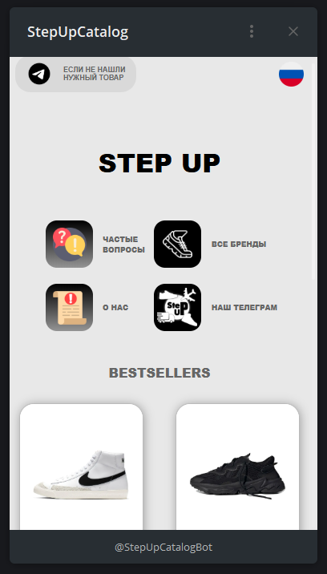
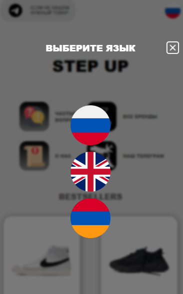
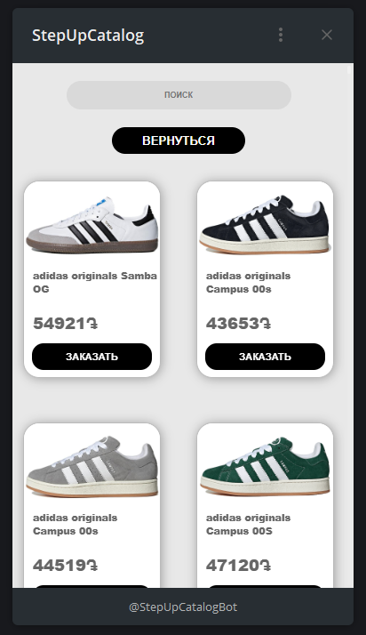

# 🛍️ StepUp WebApp — мини-магазин для Telegram Mini Apps 📦

**StepUp** — это лёгкий и адаптивный мини-магазин, созданный как Telegram Mini App. Пользователи могут выбрать товары и оформить заказ прямо внутри Telegram, а владелец мгновенно получает уведомление через Telegram-бота 🤖📲


---

## 🌐 Описание

Мини-магазин открывается по кнопке из Telegram-бота с поддержкой Telegram Web Apps API.  
Позволяет:

- 🛒 выбрать товар  
- 📝 заполнить контактные данные  
- 📤 отправить заказ владельцу (через Telegram-бота)

---

## ✨ Особенности

- 📱 **Поддержка Telegram Web Apps** — открывается внутри Telegram  
- 🌍 **Поддержка трёх языков** 
- 🛒 **Интерактивная корзина** — добавление/удаление товаров  
- 📲 **Telegram-уведомления о заказе** — всё приходит сразу владельцу  
- ⚡ **Облачный хостинг** — сайт всегда доступен и работает стабильно

---

## 🧩 Используемые технологии

- ⚛️ [React](https://react.dev/)
- 🌀 [React i18next](https://react.i18next.com/) — мультиязычность
- 📦 [Vite](https://vitejs.dev/)
- 🌐 [Telegram Web Apps API](https://core.telegram.org/bots/webapps)
- ☁️ Облачный VPS 

---

## 🖼️ Интерфейс




---

```bash
# 1. Клонируй репозиторий
git clone https://github.com/Badadsher/stepup-webapp.git

# 2. Перейди в папку
cd stepup-webapp

# 3. Установи зависимости
npm install

# 4. Запусти приложение
npm run dev
